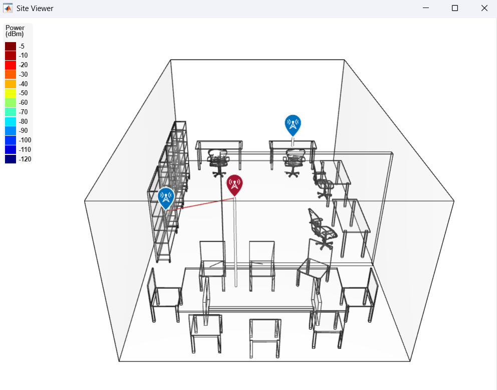
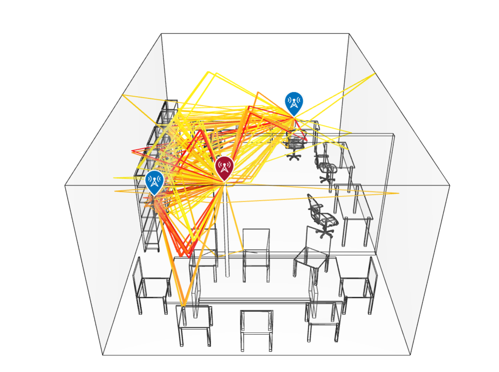
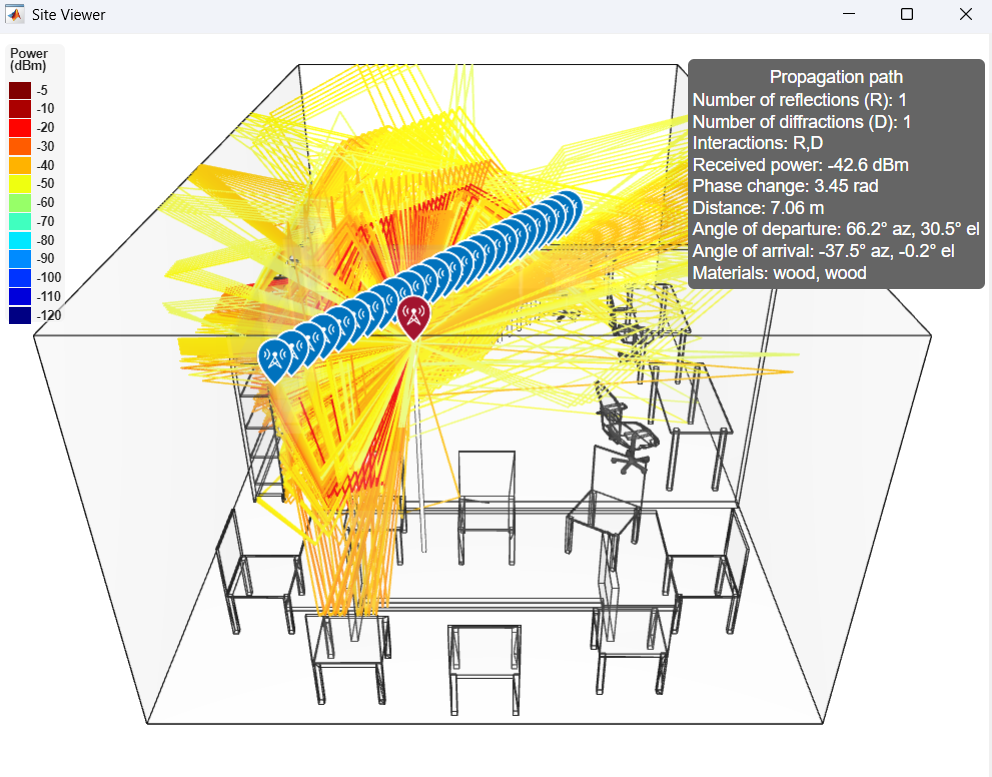
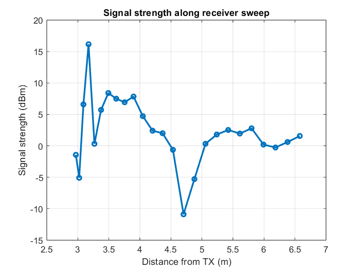
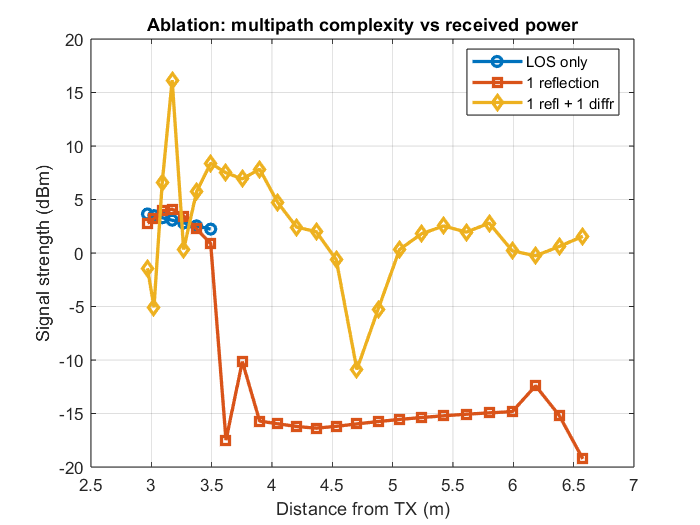

# Indoor RF Propagation Simulation (MATLAB)

A modular MATLAB framework for simulating **indoor RF propagation** using **3D ray tracing**.  
The simulator models **line-of-sight (LOS), reflections, and diffraction** inside a 3D scene and analyzes how multipath complexity affects received signal strength.

This project demonstrates how indoor geometry impacts wireless communication systems such as **RAIN RFID deployments in warehouses or offices**.

---

## Key Features

- 3D indoor propagation using **STL scene geometry**
- MATLAB **ray tracing propagation model**
- **Receiver sweep experiment** to observe spatial fading
- **Multipath ablation study** (LOS vs reflections vs diffraction)
- **Object-oriented MATLAB design** for modular simulations

---

## Example Results

### Indoor Scene


### Ray Tracing Paths


### Receiver Sweep


### Signal Strength Along Sweep


### Multipath Ablation


**Observations**

- LOS-only propagation produces smooth signal variation  
- Reflections introduce **destructive interference and deep fades**  
- Diffraction introduces additional propagation paths  

---

## Repository Structure
├── main.m
├── WarehouseConfig.m
├── SiteFactory.m
├── WarehouseScene.m
├── PropagationSimulator.m
├── ResultVisualizer.m
├── office.stl
├── Figures/
│ ├── office.png
│ ├── 1r1d.png
│ ├── multiple_antenna_1r1d.png
│ ├── signal_strength.png
│ └── ablation.png
└── Warehouse_Propagation.pdf


**main.m**  
Entry point that runs the complete simulation pipeline.

**WarehouseConfig.m**  
Stores configuration parameters (scene, transmitter, receivers, propagation settings).

**SiteFactory.m**  
Creates transmitter and receiver site objects.

**WarehouseScene.m**  
Loads the STL scene and visualizes transmitter/receiver placement.

**PropagationSimulator.m**  
Runs ray tracing propagation and computes received signal strength.

**ResultVisualizer.m**  
Generates signal strength and ablation plots.

---

## Simulation Pipeline
3D Scene (STL)
↓
Site Placement
↓
Ray Tracing Model
↓
Propagation Paths
↓
Signal Strength Analysis
↓
Visualization


---

## Mathematical Model

The received signal is modeled as a **sum of multipath components**:

\[
h = \sum_{\ell=1}^{L} \alpha_\ell e^{-j2\pi f_c \tau_\ell}
\]

The received power is proportional to

\[
P_r \propto |h|^2
\]

Multipath interference therefore produces **constructive peaks** and **deep fades**.

---

## Requirements

MATLAB with:

- Communications Toolbox
- Antenna / RF propagation functionality

---

## Running the Simulation

Run the main script:

```matlab
main
